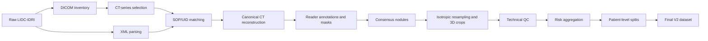
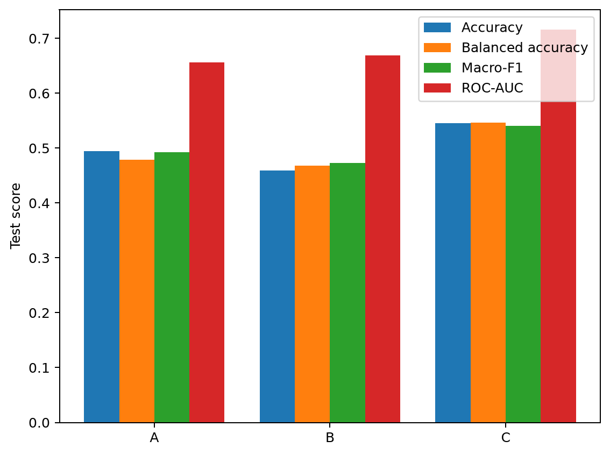
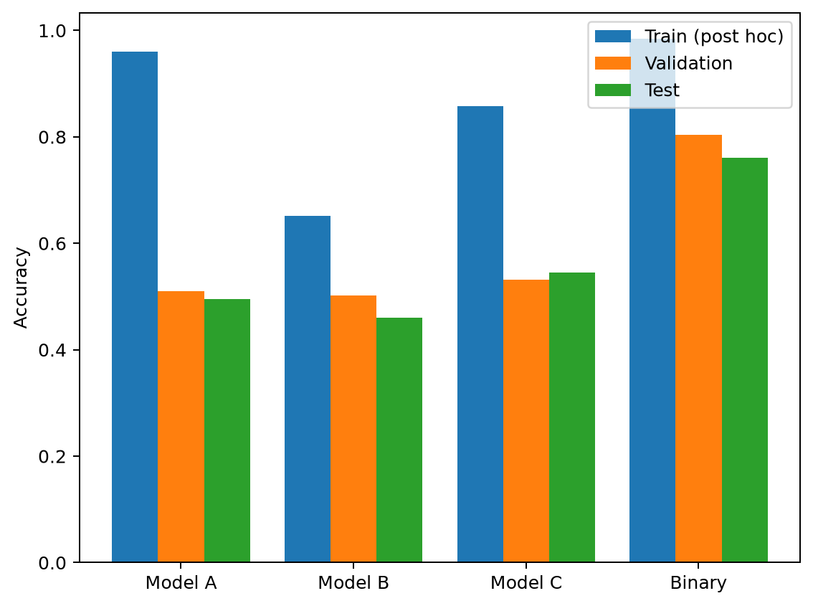
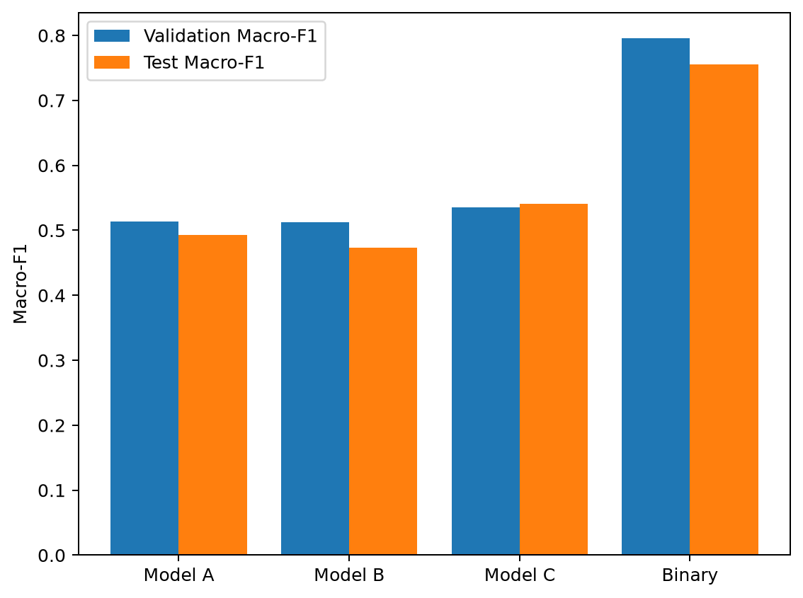
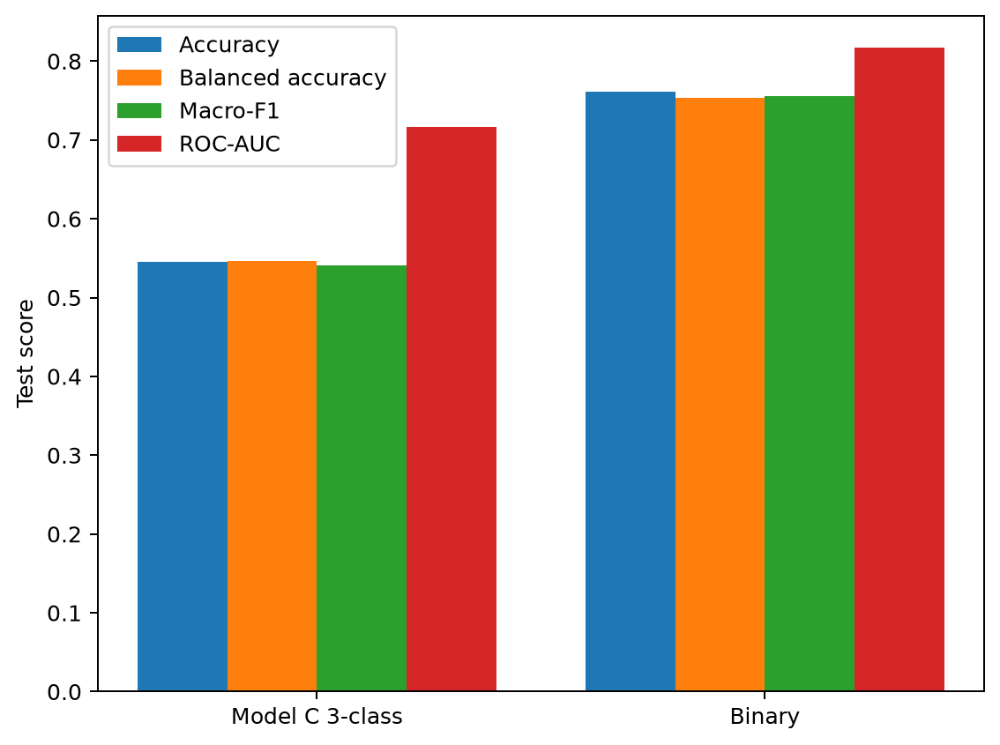

# From Slices to Volumes: Comparing 2D, 2.5D and 3D Deep Learning for Pulmonary Nodule Malignancy-Risk Classification

Repository: `CT-2D-2.5D-3D-DeepLearning`

## Project overview

Computed Tomography (CT) is volumetric data composed of consecutive image
slices. Deep-learning models can use different amounts of that spatial context:

- **2D:** one CT slice.
- **2.5D:** five neighboring CT slices used together.
- **3D:** the full local nodule volume.

This project studies how representation dimensionality affects pulmonary nodule
malignancy-risk classification. The goal is to compare these representations
under a shared dataset, label policy, patient-level split, preprocessing
contract, and evaluation philosophy. The project does not assume that a 3D
model must perform better.

## Research questions

1. How does spatial context affect classification: 2D vs 2.5D vs 3D?
2. Does MoCo self-supervised pretraining improve downstream 3-class
   classification?
3. Does training-time augmentation reduce overfitting and improve
   generalization?
4. How much does performance change when the indeterminate malignancy-risk
   group is excluded?

## Team approaches

| Team member | Representation and model |
|---|---|
| Bahodir | 2D ResNet-18 using one central CT slice |
| Fatima | 2.5D ResNet-18 using five neighboring slices |
| Zaineb | 3D ResNet-18 using the local CT volume |

The architectures do not necessarily have equal capacity. The fair comparison
comes from using the shared dataset, label definitions, patient assignments,
preprocessing, and evaluation principles while varying the input
representation.

## Dataset: LIDC-IDRI

LIDC-IDRI contains thoracic CT scans, DICOM imaging data, XML radiologist
annotations, multiple reader observations, and malignancy-risk scores. The
labels used here are aggregated radiologist malignancy-risk assessments. They
are **not pathology-confirmed cancer ground truth** and should not be
interpreted as clinical diagnostic performance.

The detailed dataset and quality-control documentation is in:

- [Dataset preparation](docs/DATASET_PREPARATION.md)
- [Cleaning pipeline](docs/CLEANING_PIPELINE.md)
- [Label policy](docs/LABEL_POLICY.md)
- [Data validation](docs/DATA_VALIDATION.md)

## Data preparation pipeline

The reproducible source-only pipeline follows this sequence:

```text
Raw LIDC-IDRI
→ DICOM inventory
→ CT-series selection
→ XML parsing
→ SOP/UID matching
→ canonical CT reconstruction
→ reader annotations and masks
→ consensus nodules
→ isotropic resampling
→ 3D crop generation
→ technical QC
→ malignancy-risk aggregation
→ patient-level splitting
→ final V2 dataset
```



See [CLEANING_PIPELINE.md](docs/CLEANING_PIPELINE.md) for the full
implementation-level description.

## Verified dataset statistics

| Stage or split | Nodules/records | Patients |
|---|---:|---:|
| Patients processed | — | 1,010 |
| DICOM records inventoried | 244,527 | — |
| XML files parsed | 1,318 | — |
| Valid CT series | 1,018 | — |
| Consensus nodules | 7,385 | 990 represented |
| Rated consensus nodules | 2,672 | — |
| Final supervised cohort | 2,654 | — |
| SSL training pool | 5,133 | 692 |

### Supervised classes

| Class | Nodules |
|---|---:|
| Benign | 873 |
| Indeterminate | 1,226 |
| Malignant | 555 |

### Fixed patient-level splits

| Split | Nodules | Patients |
|---|---:|---:|
| Train | 1,876 | 602 |
| Validation | 382 | 134 |
| Test | 396 | 134 |

Patient overlap between the fixed splits is **0**. The SSL pool uses training
patients only and contains no validation or test patients.

## Label policy

Labels are assigned from the aggregated median malignancy-risk score. Half
values arise from aggregation across readers.

| Median score | Class |
|---|---|
| 1.0–2.0 | Benign |
| 2.5–3.0 | Indeterminate |
| 3.5–5.0 | Malignant |

See [LABEL_POLICY.md](docs/LABEL_POLICY.md) for the full three-class and
supplementary binary policies.

## Shared preprocessing

The final common intensity preprocessing for the 2D, 2.5D, and 3D comparison
is:

```text
HU clipping:  [-1000, 400]
Normalization: (x + 1000) / 1400
Result:       [0, 1]
```

The final 3D crops have shape `(104, 72, 80)` in `(Z, Y, X)` order at 1 mm
isotropic spacing. Masks are retained for audit and visualization but are not
used as model inputs.

## Experimental design

The primary task is three-class classification: benign, indeterminate, and
malignant.

| Experiment | Training design |
|---|---|
| **Model A** | Random initialization, supervised 3-class baseline, no training augmentation |
| **Model B** | MoCo self-supervised pretraining followed by supervised 3-class fine-tuning; no supervised augmentation |
| **Model C** | Random initialization, supervised 3-class training with training-only mild augmentation |
| **Binary sensitivity** | Supervised benign-versus-malignant experiment using the Model C recipe; indeterminate nodules excluded |

Model B uses the 5,133-sample training-patient SSL pool with malignancy labels
ignored during pretraining. The binary experiment is supplementary; its
two-class metrics are not directly equivalent to the primary three-class
metrics.

## Final 3D track

The final 3D classifier is a lightweight 3D ResNet-18:

- Input: `[B, 1, 104, 72, 80]`
- Residual block layout: `[2, 2, 2, 2]`
- Channels: `16 → 32 → 64 → 128`
- Adaptive global-average pooling
- Dropout: `0.20`
- Parameters: `2,073,747` for the 3-class head and `2,073,618` for the binary head
- Checkpoint selection: validation Macro-F1

See [3D_METHOD.md](docs/3D_METHOD.md) for the frozen 3D protocol.

## Final 3D results

Values are from the official saved final metrics table. Binary is a different
two-class task and must not be compared directly with the three-class results.

| Experiment | Validation Macro-F1 | Test accuracy | Test balanced accuracy | Test Macro-F1 | ROC-AUC |
|---|---:|---:|---:|---:|---:|
| Model A | 0.5139 | 0.4949 | 0.4790 | 0.4928 | 0.6564 |
| Model B — MoCo | 0.5127 | 0.4596 | 0.4683 | 0.4730 | 0.6692 |
| Model C — augmentation | 0.5356 | 0.5455 | 0.5461 | 0.5403 | 0.7165 |
| **Binary — two-class sensitivity analysis** | **0.7954** | **0.7608** | **0.7538** | **0.7554** | **0.8168** |

The complete interpretation and machine-readable results are in
[3D_RESULTS.md](docs/3D_RESULTS.md) and [results/3d/](results/3d/).

### Current 3D findings

- Model A showed substantial overfitting.
- MoCo changed the learned representation but did not improve downstream test
  Macro-F1 in this experiment.
- Model C produced the strongest final three-class 3D result.
- Training-only augmentation improved generalization relative to Model A.
- Binary performance was substantially higher after excluding the indeterminate
  group, supporting the interpretation that intermediate malignancy-risk
  ambiguity contributes strongly to task difficulty. It does not show that
  indeterminate cases are the sole cause.

## Selected 3D figures

<p align="center">
  
</p>

<p align="center">
  
</p>

<p align="center">
  
</p>

<p align="center">
  
</p>

The remaining learning curves and confusion-matrix figures are available in
[results/3d/figures/](results/3d/figures/). Figures are generated by
[`scripts/plot_3d_results.py`](scripts/plot_3d_results.py).

## Repository structure

```text
CT-2D-2.5D-3D-DeepLearning/
├── data/                 # External-data policy; no medical data committed
├── data_pipeline/        # Reproducible LIDC-IDRI cleaning source/config
├── docs/                 # Dataset, protocol, cleaning, and results docs
├── results/
│   ├── 2d/               # 2D results and analyses
│   └── 3d/               # Final 3D results and figures
├── src/
│   ├── 2d/
│   ├── 2p5d/
│   ├── 3d/
│   └── common/
├── scripts/              # Training, evaluation, plotting, and utilities
├── binary_experiment/    # Binary metadata and report
├── requirements.txt
└── README.md
```

## Documentation index

### Dataset and cleaning

- [Dataset preparation](docs/DATASET_PREPARATION.md)
- [Cleaning pipeline](docs/CLEANING_PIPELINE.md)
- [Label policy](docs/LABEL_POLICY.md)
- [Fixed data splits](docs/DATA_SPLITS.md)
- [Data validation](docs/DATA_VALIDATION.md)
- [Original dataset overview](docs/dataset.md)

### Methods and results

- [3D method](docs/3D_METHOD.md)
- [3D results](docs/3D_RESULTS.md)
- [Preprocessing contract](docs/preprocessing_contract.md)
- [Experimental protocol](docs/experimental_protocol.md)
- [2D report](results/2d/REPORT.md)
- [2D analysis](results/2d/ANALYSIS.md)

## Reproducibility and data availability

Medical data are not committed to GitHub. The repository does not redistribute
DICOM files, raw XML dataset dumps, processed arrays, masks, NIfTI volumes, or
model checkpoints. Source code, configuration examples, documentation, and
small result artifacts are included.

The LIDC-IDRI dataset must be obtained separately. See [data/README.md](data/README.md)
for the expected external layout. Fixed patient-level splits are used, test
data are not used for tuning or checkpoint selection, and seed information is
documented in the corresponding model tracks. See the scripts and detailed
method documents for reproducible commands rather than copying data into this
repository.

## Project status

### Completed

- Reproducible LIDC-IDRI cleaning pipeline source and documentation
- V2 supervised and SSL dataset definition
- Fixed patient-level train/validation/test split
- 2D implementation and results
- Final 3D implementation and results
- Dataset validation and quality-control documentation

### In progress / being integrated

- Final 2.5D reporting
- Final cross-representation 2D vs 2.5D vs 3D analysis

The project reports malignancy-risk classification from radiologist
assessments; it does not claim clinical diagnostic performance.
