# 2.5D Deep Learning Experiment Report

## From Slices to Volumes: Comparing 2D, 2.5D and 3D Deep Learning for CT Pulmonary Nodule Malignancy-Risk Classification

**Representation:** 2.5D
**Model:** ResNet-18
**Student:** Fatima
**Experiments:** Supervised baseline, MoCo + fine-tuning, mild augmentation, and binary classification

---

## 1. Overview

This experiment evaluates a **2.5D representation** for pulmonary nodule malignancy-risk classification from CT data.

The main idea of 2.5D is to use several neighboring CT slices as different input channels. Instead of using only the central slice, five consecutive slices are used:

```text
[z-2, z-1, z, z+1, z+2]
```

This provides the model with limited information from the surrounding slices while retaining the computational advantages of a 2D convolutional architecture.

The experiments compare three 3-class training settings:

* **Model A:** supervised training from random initialization
* **Model B:** MoCo self-supervised pretraining followed by supervised fine-tuning
* **Model C:** supervised training with mild training-only augmentation

A separate **binary classification experiment** was also performed after removing indeterminate cases.

All reported results are from **single training runs**. No mean ± standard deviation across multiple random seeds is reported.

---

# 2. Dataset and Label Definition

The experiments use the finalized Phase 3 dataset prepared for the team project.

The supervised dataset contains three classes:

| Class         | Label definition                 |
| ------------- | -------------------------------- |
| Benign        | Median malignancy rating 1.0–2.0 |
| Indeterminate | Median malignancy rating 2.5–3.0 |
| Malignant     | Median malignancy rating 3.5–5.0 |

The 3-class supervised dataset contains **2,654 eligible nodules**:

* Benign: 873
* Indeterminate: 1,226
* Malignant: 555

The fixed supervised split contains:

* Training: 1,876 samples
* Validation: 382 samples
* Test: 396 samples

The patient-level split was fixed by the finalized dataset, and no new split was created for these experiments.

For the binary experiment, indeterminate cases were excluded:

* Training: 1,000 samples
* Validation: 219 samples
* Test: 209 samples

The binary labels are:

```text
Benign = 0
Malignant = 1
```

The binary experiment uses its provided fixed train/validation/test CSV files.

> The malignancy labels represent radiologist-assessed malignancy ratings. They should not be interpreted as pathology-confirmed lung cancer diagnoses for every nodule.

---

# 3. 2.5D Representation

For each nodule, the segmentation mask was used to determine the central axial slice.

The center slice was calculated from the median z-coordinate of the mask voxels. Five neighboring slices were then extracted:

```text
[z-2, z-1, z, z+1, z+2]
```

Therefore, each input contains five channels:

```text
Channel 1 → z-2
Channel 2 → z-1
Channel 3 → z
Channel 4 → z+1
Channel 5 → z+2
```

The five slices preserve their original channel order.

Unlike a conventional 2D model that receives one slice, the 2.5D model can use information immediately above and below the central slice.

The resulting tensor has the form:

```text
[5, H, W]
```

and the training batch has the form:

```text
[batch_size, 5, H, W]
```

---

# 4. Preprocessing

The same preprocessing was used across the 3-class experiments and the binary experiment.

CT intensity values were first clipped to the range:

```text
[-1000, 400] HU
```

They were then linearly normalized to approximately `[0, 1]`:

```python
slices = np.clip(slices, -1000, 400)
slices = (slices + 1000) / 1400
```

No additional standardization was applied.

The same preprocessing policy was maintained for:

* Model A
* Model B fine-tuning
* Model C
* Binary classification

This was done to keep the comparison between experiments consistent.

---

# 5. Model Architecture

A standard **ResNet-18** architecture was used as the main 2.5D backbone.

Because standard ResNet-18 expects three RGB channels, the first convolution was modified to accept five channels.

The input convolution was changed to:

```text
Input channels: 5
Output channels: 64
Kernel size: 7 × 7
Stride: 2
Padding: 3
```

For the 3-class experiments, the final fully connected layer was changed to produce three outputs:

```text
Benign
Indeterminate
Malignant
```

The resulting model contains:

**11,184,323 trainable parameters.**

---

# 6. Model A — Supervised Baseline

Model A was trained directly using the 3-class supervised training set with random initialization.

### Training configuration

| Setting                 | Value               |
| ----------------------- | ------------------- |
| Architecture            | 5-channel ResNet-18 |
| Classes                 | 3                   |
| Batch size              | 8                   |
| Optimizer               | AdamW               |
| Learning rate           | 0.001               |
| Weight decay            | 0.0001              |
| Maximum epochs          | 20                  |
| Loss                    | Cross-Entropy       |
| Augmentation            | None                |
| Checkpoint criterion    | Validation Macro-F1 |
| Early stopping patience | 5                   |

The best validation checkpoint occurred at:

**Epoch 9**

with:

**Validation Macro-F1 = 0.5883**

### Test results

| Metric            | Model A |
| ----------------- | ------: |
| Accuracy          |  0.6086 |
| Balanced Accuracy |  0.6060 |
| Macro-F1          |  0.6075 |
| ROC-AUC           |  0.7583 |

### Per-class performance

| Class         | Precision | Recall |     F1 |
| ------------- | --------: | -----: | -----: |
| Benign        |    0.5678 | 0.5726 | 0.5702 |
| Indeterminate |    0.6190 | 0.6257 | 0.6223 |
| Malignant     |    0.6404 | 0.6196 | 0.6298 |

### Confusion matrix

```text
                Predicted
              B     I     M
Actual B     67    42     8
       I     46   117    24
       M      5    30    57
```

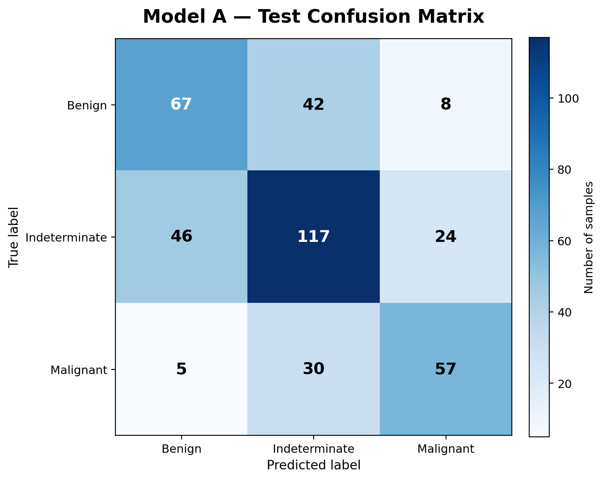

### Training curves

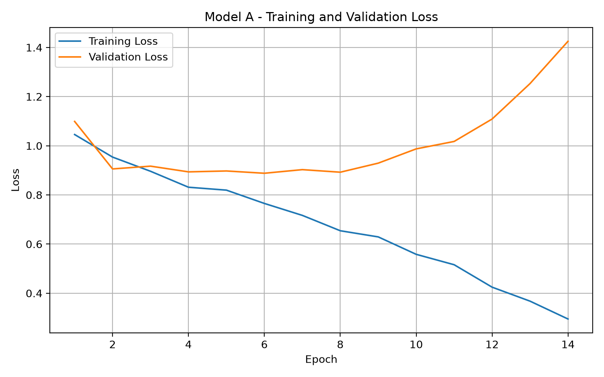

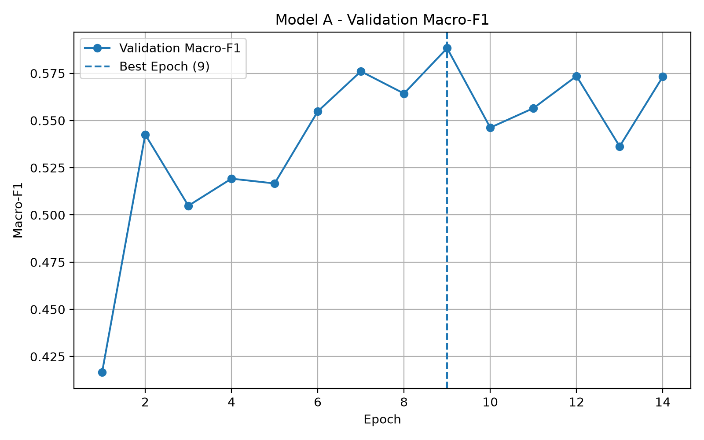

---

# 7. Model B — MoCo Pretraining + Fine-tuning

Model B used self-supervised **MoCo (Momentum Contrast)** pretraining before supervised fine-tuning.

The purpose was to determine whether self-supervised representation learning could improve the final 3-class classification performance.

## 7.1 MoCo pretraining

The MoCo encoder used the same 5-channel ResNet-18 representation.

Main settings:

| Setting              | Value          |
| -------------------- | -------------- |
| Input                | 5-channel 2.5D |
| Projection dimension | 128            |
| Queue size           | 512            |
| Momentum             | 0.999          |
| Temperature          | 0.07           |
| Batch size           | 8              |
| Learning rate        | 0.001          |
| Weight decay         | 0.0001         |
| Epochs               | 20             |
| Optimizer            | AdamW          |

The MoCo training loss decreased throughout pretraining, from approximately **3.7805** at the first epoch to **0.1156** at the twentieth epoch.

[MoCo pretraining history](../results/2.5d/moco_pretraining/history.json)

The pretrained encoder was then used to initialize the supervised model.

## 7.2 Fine-tuning

The fine-tuning stage used the same supervised training and validation sets as Model A.

The best validation checkpoint occurred at:

**Epoch 5**

with:

**Validation Macro-F1 = 0.5516**

### Test results

| Metric            | Model B |
| ----------------- | ------: |
| Accuracy          |  0.5126 |
| Balanced Accuracy |  0.4914 |
| Macro-F1          |  0.5125 |
| ROC-AUC           |  0.6922 |

### Per-class performance

| Class         | Precision | Recall |     F1 |
| ------------- | --------: | -----: | -----: |
| Benign        |    0.3403 | 0.4188 | 0.3755 |
| Indeterminate |    0.5600 | 0.5989 | 0.5788 |
| Malignant     |    0.8077 | 0.4565 | 0.5833 |

### Confusion matrix

```text
                Predicted
              B     I     M
Actual B     49    65     3
       I     68   112     7
       M     27    23    42
```

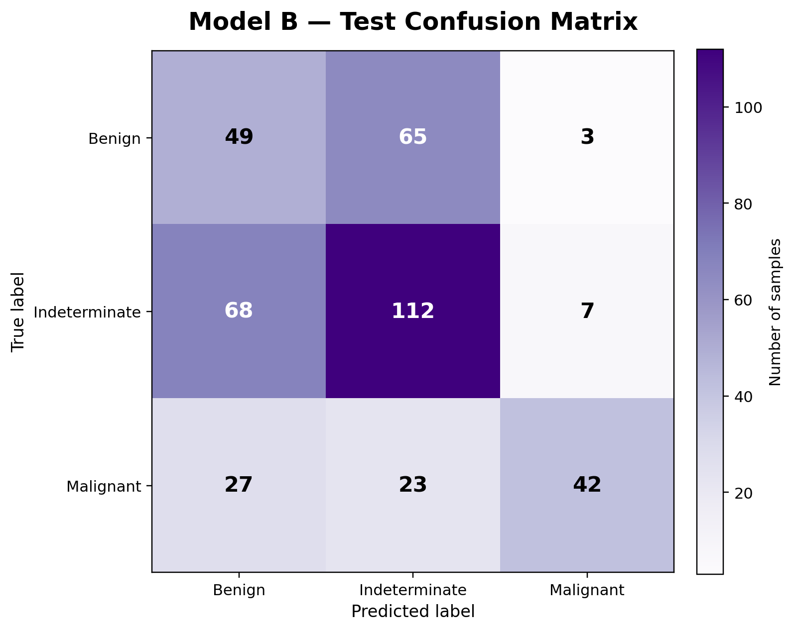

### Training curves

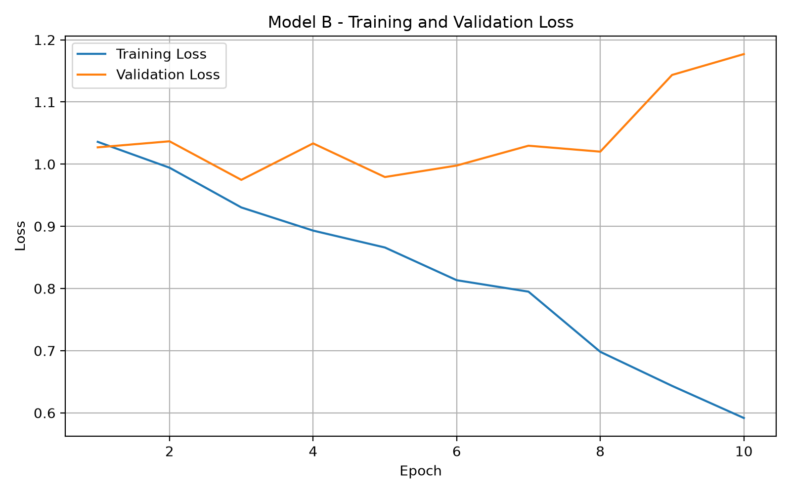

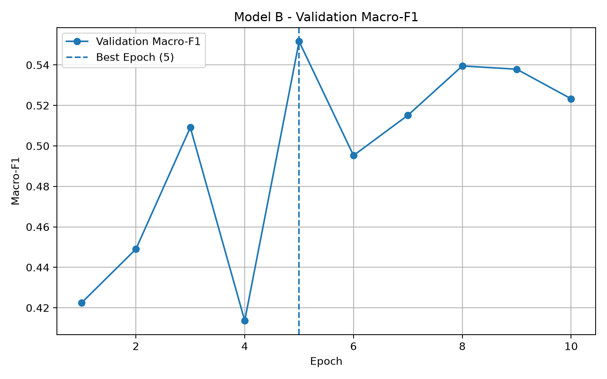

---

# 8. Model C — Mild Training Augmentation

Model C used the same supervised 3-class setup as Model A but added mild augmentation during training.

The augmentation was applied jointly to the five 2.5D channels so that the spatial relationship between neighboring slices was preserved.

The augmentation recipe included:

* horizontal flipping with probability 0.5
* vertical flipping with probability 0.5
* intensity scaling and shifting with probability 0.5
* small Gaussian noise with probability 0.3
* clipping back to `[0,1]`

The augmentation was used **only during training**. Validation and test samples were not augmented.

### Training configuration

| Setting                 | Value               |
| ----------------------- | ------------------- |
| Architecture            | 5-channel ResNet-18 |
| Classes                 | 3                   |
| Batch size              | 8                   |
| Optimizer               | AdamW               |
| Learning rate           | 0.001               |
| Weight decay            | 0.0001              |
| Maximum epochs          | 20                  |
| Loss                    | Cross-Entropy       |
| Augmentation            | Mild                |
| Checkpoint criterion    | Validation Macro-F1 |
| Early stopping patience | 5                   |

The best checkpoint occurred at:

**Epoch 12**

with:

**Validation Macro-F1 = 0.5857**

### Test results

| Metric            | Model C |
| ----------------- | ------: |
| Accuracy          |  0.6869 |
| Balanced Accuracy |  0.6413 |
| Macro-F1          |  0.6537 |
| ROC-AUC           |  0.7894 |

### Per-class performance

| Class         | Precision | Recall |     F1 |
| ------------- | --------: | -----: | -----: |
| Benign        |    0.8261 | 0.3248 | 0.4663 |
| Indeterminate |    0.6218 | 0.9144 | 0.7403 |
| Malignant     |    0.8400 | 0.6848 | 0.7545 |

### Confusion matrix

```text
                Predicted
              B     I     M
Actual B     38    75     4
       I      8   171     8
       M      0    29    63
```

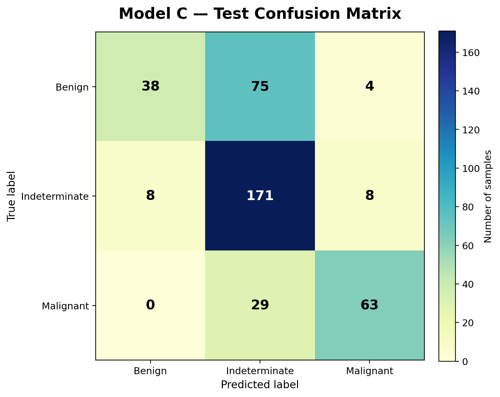

### Training curves

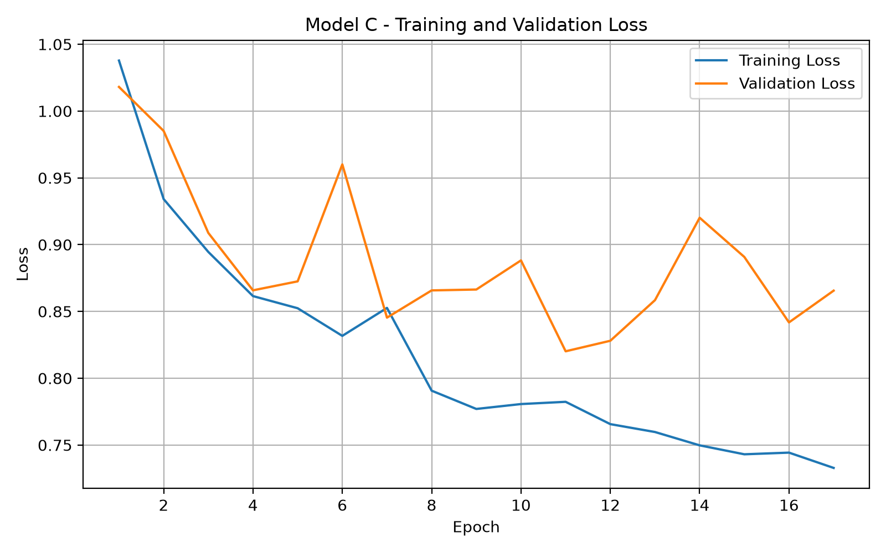

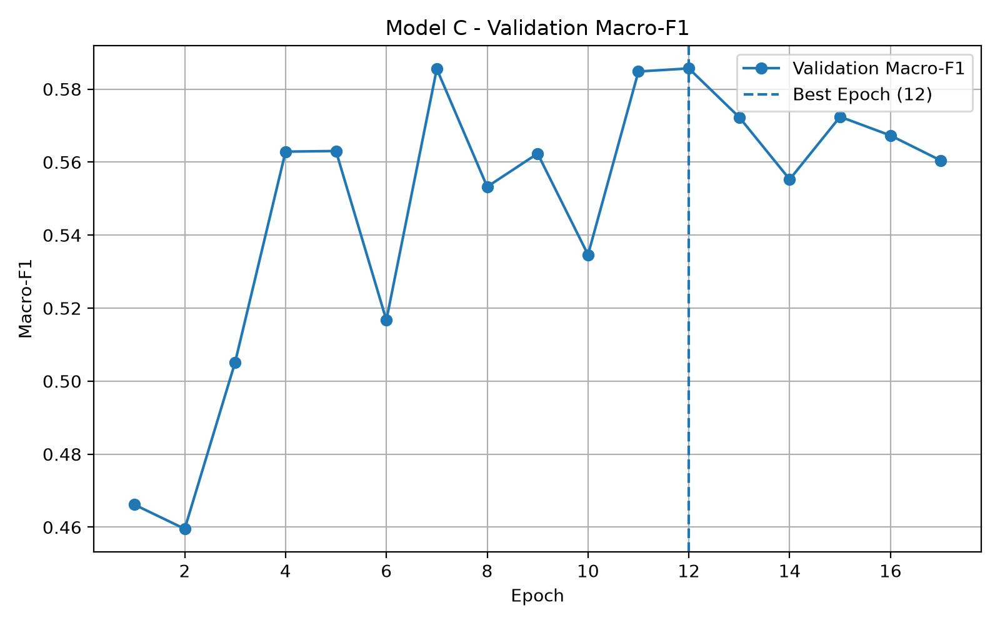

---

# 9. Comparison of the 3-Class Models

The final test performance is summarized below.

| Model                       |   Accuracy | Balanced Accuracy |   Macro-F1 |    ROC-AUC |
| --------------------------- | ---------: | ----------------: | ---------: | ---------: |
| Model A — Supervised        |     0.6086 |            0.6060 |     0.6075 |     0.7583 |
| Model B — MoCo              |     0.5126 |            0.4914 |     0.5125 |     0.6922 |
| Model C — Mild Augmentation | **0.6869** |        **0.6413** | **0.6537** | **0.7894** |

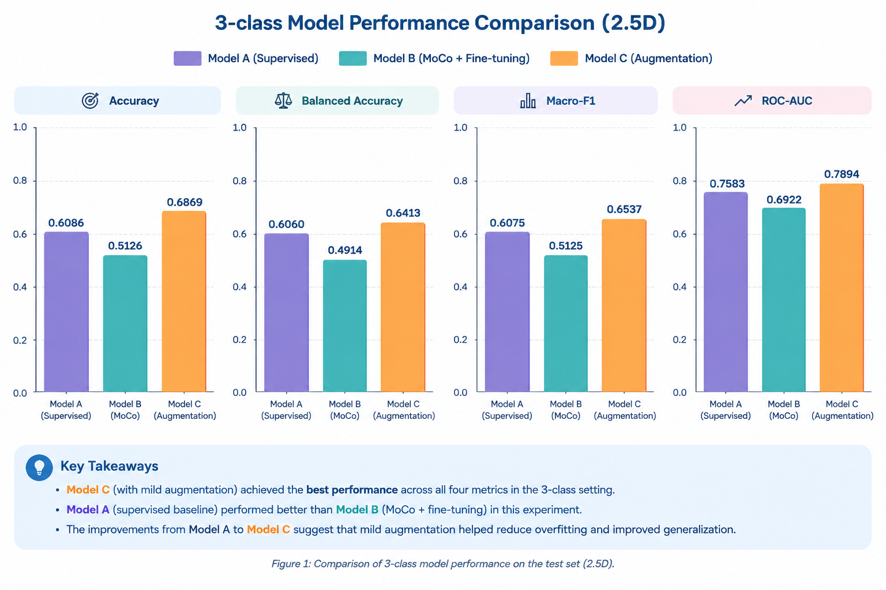

Model C produced the strongest overall test performance among the three 2.5D 3-class models.

Compared with Model A, Model C improved:

* Accuracy: 0.6086 → 0.6869
* Balanced Accuracy: 0.6060 → 0.6413
* Macro-F1: 0.6075 → 0.6537
* ROC-AUC: 0.7583 → 0.7894

---

# 10. Training and Validation Behavior

Model A showed a clear tendency toward overfitting.

At the selected Model A checkpoint, the training Macro-F1 was approximately **0.8286**, while the validation Macro-F1 was **0.5883**.

This gives a train-validation gap of approximately:

**0.2403**

The training loss also continued to decrease while the validation loss increased after the earlier epochs.

This suggests that the model increasingly fitted the training data without achieving corresponding improvements on validation data.

Model C showed a smaller generalization gap.

At its selected checkpoint:

* Training Macro-F1: **0.6469**
* Validation Macro-F1: **0.5857**
* Train-validation gap: **0.0612**

Therefore, the mild augmentation substantially reduced the observed train-validation gap.

The results suggest that the augmentation acted as a useful regularizer for the 2.5D model.

---

# 11. Effect of MoCo Pretraining

The MoCo experiment did **not** improve the final supervised performance in this single run.

Comparison:

| Metric            | Model A | Model B |
| ----------------- | ------: | ------: |
| Accuracy          |  0.6086 |  0.5126 |
| Balanced Accuracy |  0.6060 |  0.4914 |
| Macro-F1          |  0.6075 |  0.5125 |
| ROC-AUC           |  0.7583 |  0.6922 |

Model B was lower than the directly supervised baseline on all four reported metrics.

The MoCo pretraining loss decreased substantially during self-supervised training, indicating that the contrastive pretraining objective was being optimized. However, good pretraining loss reduction did not translate into better downstream classification performance.

Possible explanations include:

* the self-supervised objective may not have produced representations that were optimal for the small supervised classification task;
* the supervised dataset may already provide sufficient signal for direct training;
* the selected MoCo configuration may not have been optimal for this dataset;
* the experiment represents a single run rather than a multi-seed evaluation.

Therefore, based on this experiment, **MoCo pretraining did not provide an advantage over direct supervised training for the 2.5D model**.

---

# 12. Effect of Mild Augmentation

The comparison between Model A and Model C provides the augmentation analysis.

| 2.5D experiment                       | Model A: No augmentation | Model C: Mild augmentation |
| ------------------------------------- | -----------------------: | -------------------------: |
| Test Accuracy                         |                   0.6086 |                 **0.6869** |
| Test Macro-F1                         |                   0.6075 |                 **0.6537** |
| Validation Macro-F1                   |                   0.5883 |                     0.5857 |
| Train Macro-F1 at selected checkpoint |                   0.8286 |                     0.6469 |
| Train-validation gap                  |                  +0.2403 |                **+0.0612** |
| Best epoch                            |                        9 |                         12 |

Model C achieved a much better test Macro-F1 despite having a slightly lower best validation Macro-F1 than Model A.

The most notable difference is the much smaller train-validation gap.

This suggests that mild augmentation improved generalization and reduced overfitting in this run.

---

# 13. Binary Classification

A separate binary experiment was conducted after removing indeterminate cases.

The binary experiment used:

```text
Benign = 0
Malignant = 1
```

Indeterminate cases were excluded using the provided binary train/validation/test CSV files.

The same 2.5D representation and mild augmentation recipe were used.

### Training configuration

| Setting                 | Value                       |
| ----------------------- | --------------------------- |
| Architecture            | 5-channel ResNet-18         |
| Classes                 | 2                           |
| Batch size              | 8                           |
| Optimizer               | AdamW                       |
| Learning rate           | 0.001                       |
| Weight decay            | 0.0001                      |
| Maximum epochs          | 20                          |
| Loss                    | Cross-Entropy               |
| Augmentation            | Same mild recipe as Model C |
| Checkpoint criterion    | Validation Macro-F1         |
| Early stopping patience | 5                           |

The best checkpoint occurred at:

**Epoch 5**

with:

**Validation Macro-F1 = 0.8583**

### Binary test results

| Metric            |     Binary |
| ----------------- | ---------: |
| Accuracy          | **0.8708** |
| Balanced Accuracy | **0.8614** |
| Macro-F1          | **0.8664** |
| ROC-AUC           | **0.9215** |

### Per-class performance

| Class     | Precision | Recall |     F1 |
| --------- | --------: | -----: | -----: |
| Benign    |    0.8462 | 0.9402 | 0.8907 |
| Malignant |    0.9114 | 0.7826 | 0.8421 |

### Confusion matrix

```text
                Predicted
              B     M
Actual B     110     7
       M      20    72
```

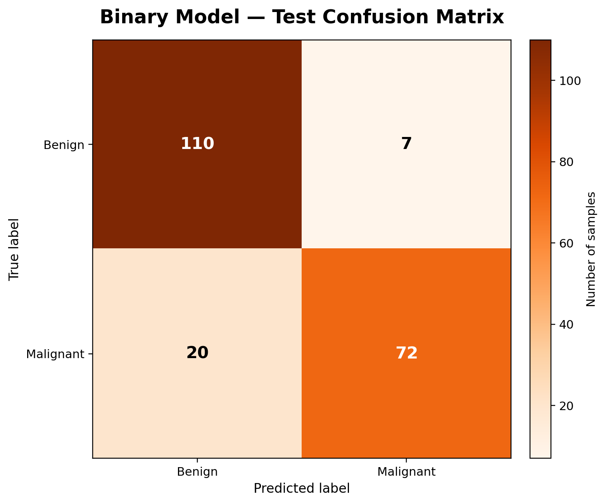

### Training curves

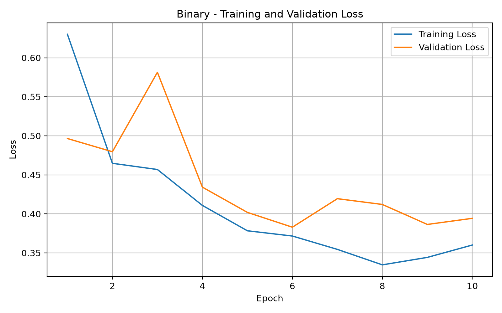

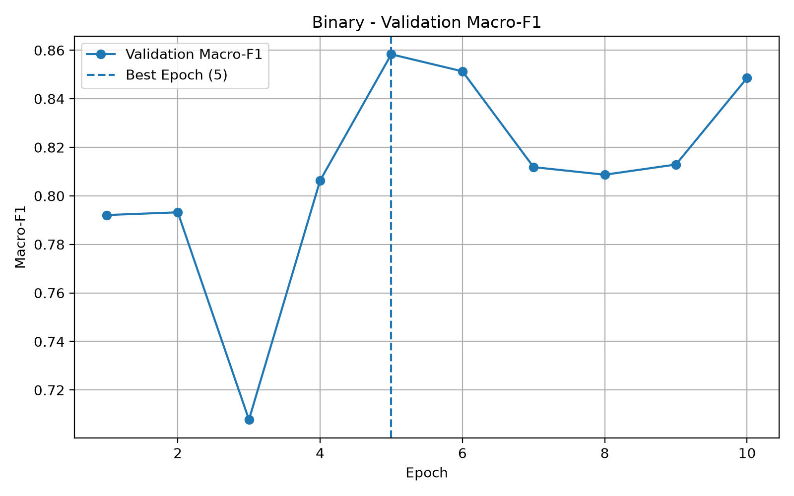

The binary results were substantially stronger than the 3-class results. However, this should not be interpreted as a direct comparison on exactly the same test samples because the binary experiment excludes indeterminate cases and therefore uses a different test set.

---

# 14. Effect of Removing Indeterminate Cases

Removing the indeterminate category produced a much easier classification problem in this experiment.

The binary model achieved:

* Accuracy: **0.8708**
* Balanced Accuracy: **0.8614**
* Macro-F1: **0.8664**
* ROC-AUC: **0.9215**

In contrast, the best 3-class model, Model C, achieved:

* Accuracy: **0.6869**
* Balanced Accuracy: **0.6413**
* Macro-F1: **0.6537**
* ROC-AUC: **0.7894**

The difference indicates that distinguishing benign from malignant nodules is easier when the intermediate/indeterminate cases are removed.

However, the two experiments use different test populations, so the results should be presented as **separate experimental settings**, not as a perfectly controlled head-to-head comparison.

---

# 15. Confident-Label Subset Analysis

An additional analysis was performed on the Model C test set using a stricter subset of samples considered more confident.

The confident subset was defined using:

* `midpoint_median_v2 == False`
* `strict_3_reader_eligible == True`
* `disagreement_flag == False`

This produced:

**23 confident test samples**

The class distribution was:

```text
Benign: 16
Indeterminate: 0
Malignant: 7
```

Model C achieved:

**Accuracy = 0.8696**

ROC-AUC was **not reported for this subset** because there were no indeterminate samples and therefore the 3-class OVR AUC could not be meaningfully calculated for this subset.

For the remaining **373 test samples**, Model C achieved:

* Accuracy: **0.6756**
* ROC-AUC: **0.7652**

Because the confident subset is very small (`N=23`), its result should be interpreted cautiously and should not be treated as a robust estimate of generalization.

---

# 16. Overall Results Summary

The main findings of the 2.5D experiments are:

### 1. Mild augmentation performed best among the 3-class models

Model C achieved the strongest test performance:

```text
Accuracy      = 0.6869
Balanced Acc. = 0.6413
Macro-F1      = 0.6537
ROC-AUC       = 0.7894
```

### 2. Direct supervised training outperformed MoCo in this run

Model B achieved lower test performance than Model A on all four main metrics.

Therefore, MoCo pretraining did not provide a downstream classification benefit in this particular experiment.

### 3. Mild augmentation reduced overfitting

The observed train-validation Macro-F1 gap decreased from:

```text
Model A: 0.2403
Model C: 0.0612
```

This supports the interpretation that the mild augmentation improved generalization.

### 4. Binary classification was substantially easier

After removing indeterminate cases, the binary model achieved:

```text
Accuracy      = 0.8708
Balanced Acc. = 0.8614
Macro-F1      = 0.8664
ROC-AUC       = 0.9215
```

However, this binary result uses a different test population and therefore should not be interpreted as a direct replacement for the 3-class experiment.

---

# 17. Limitations

Several limitations should be considered when interpreting these results.

### Single-run evaluation

All reported experiments are based on a single training run. Multiple random seeds were not used, so the results do not include mean ± standard deviation.

### Radiologist-assessed labels

The malignancy labels are based on radiologist assessments and should not be considered pathology-confirmed ground truth for every sample.

### Limited supervised sample size

The supervised 3-class dataset contains 2,654 eligible nodules, which is relatively small for training deep neural networks.

### 2.5D representation

The model uses only five axial slices around the nodule center. Therefore, it captures more spatial context than a single 2D slice but does not use the complete 3D volume.

### Computational constraints

The experiments were performed using a consumer GPU with limited VRAM. This constrained batch size and model/training choices.

### Binary and 3-class populations differ

The binary experiment excludes indeterminate cases and therefore uses a different test population. Binary and 3-class performance should not be interpreted as results from identical test samples.

### Small confident-label subset

The confident-label subset contained only 23 test samples. Its performance is therefore descriptive rather than statistically reliable.

### No hyperparameter sweep

The experiments used fixed training configurations rather than a large hyperparameter search.

---

# 18. Reproducibility

The experiment scripts and result files are included in the project repository.

The 2.5D results are organized under:

```text
results/2.5d/
```

The corresponding scripts are stored under:

```text
scripts/
```

The repository does not include the dataset or model checkpoints.

The experiments used the finalized dataset split and the provided train/validation/test CSV files. No new data split was created during the experiments.

---

# 19. Conclusion

This study evaluated a 2.5D representation in which five neighboring CT slices were treated as input channels to a modified ResNet-18.

Among the three 3-class experiments, **mild training augmentation produced the strongest test performance**, reaching a Macro-F1 of **0.6537** and ROC-AUC of **0.7894**.

The directly supervised baseline achieved a Macro-F1 of **0.6075**, while MoCo pretraining followed by fine-tuning achieved **0.5125**. Therefore, MoCo did not improve downstream classification performance in this single run.

The augmentation experiment also showed a substantially smaller train-validation gap, suggesting improved generalization and reduced overfitting.

When indeterminate cases were excluded, the binary model achieved considerably higher performance, with a Macro-F1 of **0.8664** and ROC-AUC of **0.9215**. This indicates that the intermediate/indeterminate category contributes substantially to the difficulty of the original 3-class task.

Overall, the results suggest that **2.5D provides a useful compromise between single-slice 2D input and full 3D modeling**, while mild augmentation was more beneficial than MoCo pretraining for this particular 2.5D classification setting.

These conclusions should be considered preliminary because the experiments are based on single runs and the labels represent radiologist-assessed malignancy rather than universally pathology-confirmed outcomes.
