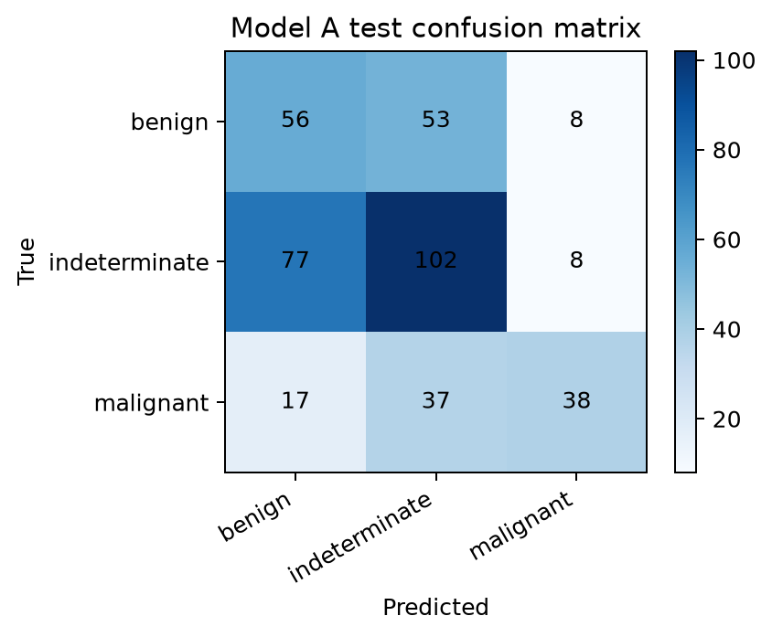
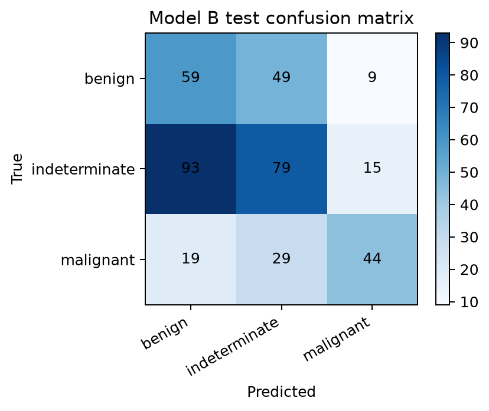
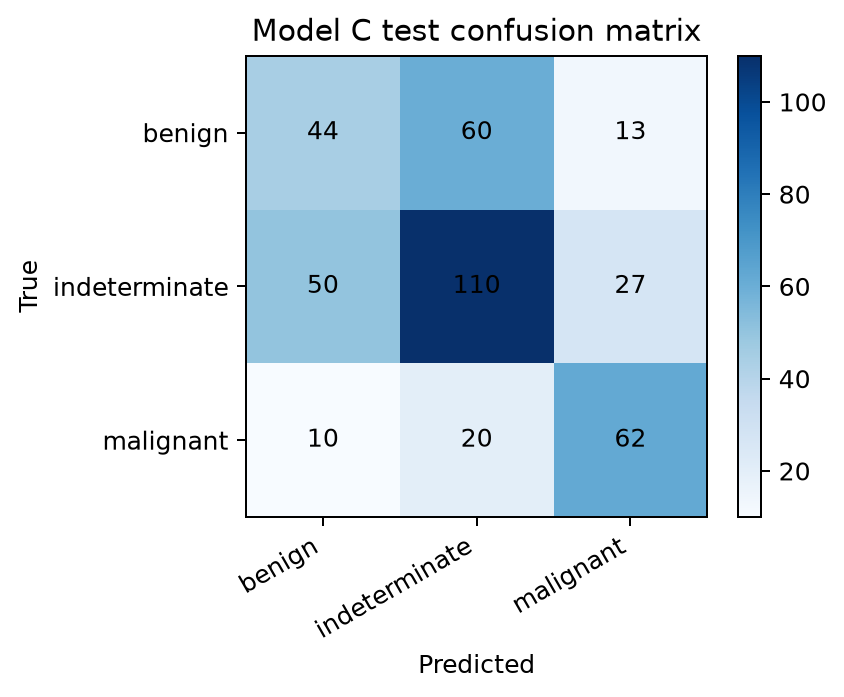
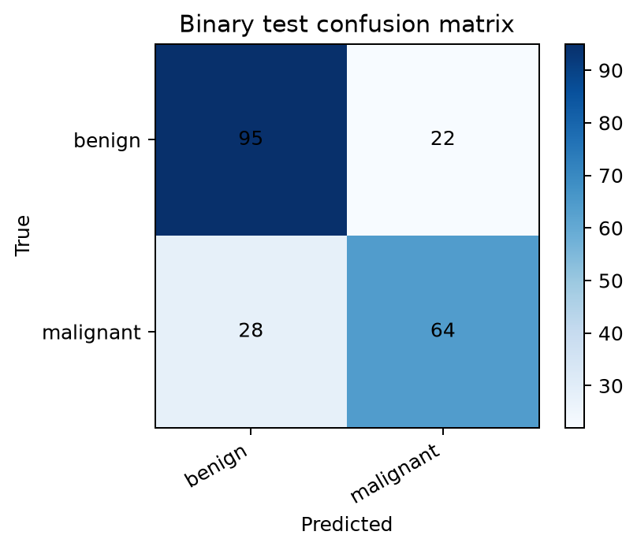
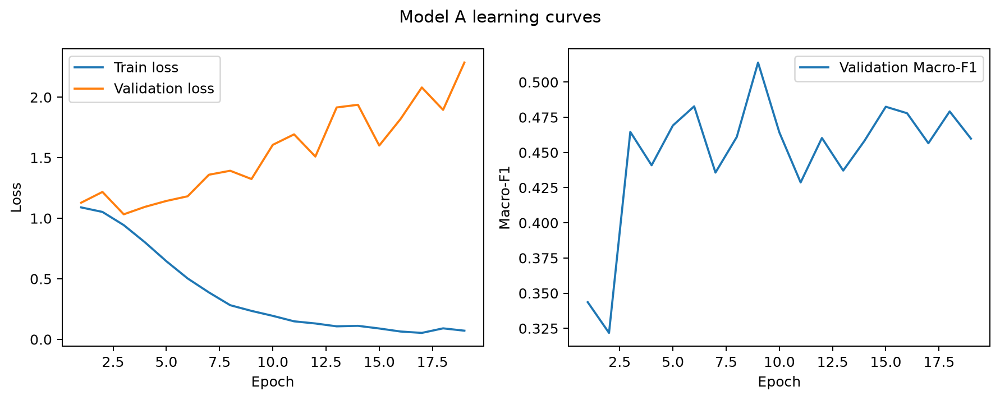
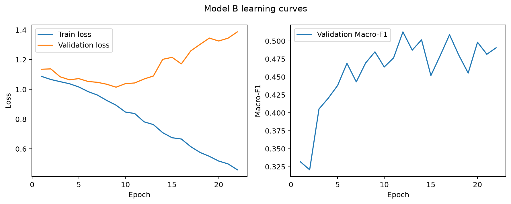
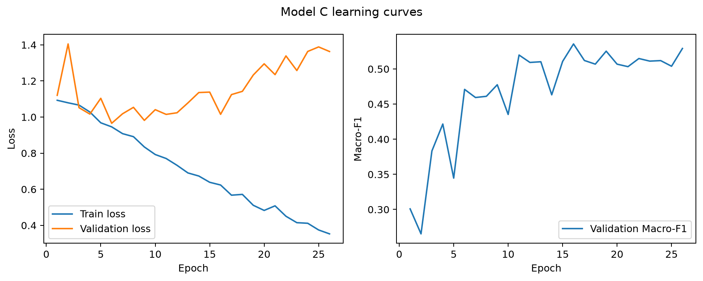
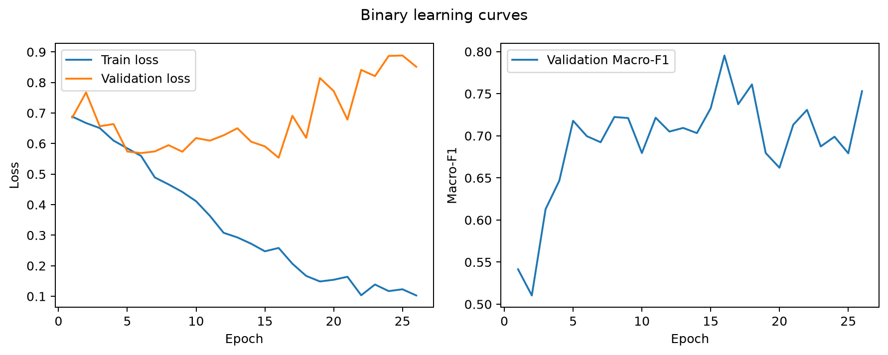

# 3D Volumetric Approach

## 1. Objective

This report describes Zaineb's final volumetric experiments for three-class
pulmonary-nodule malignancy-risk classification. Each nodule is represented by
the complete 3D crop rather than by one slice or a hand-selected set of five
slices. The model input is `[B, 1, 104, 72, 80]`, where the spatial order is
`Z, Y, X`.

The aim was to determine whether a compact volumetric representation could
learn useful structure under the fixed patient-level protocol, and to compare
randomly initialized supervised learning, MoCo pretraining, and mild
training-only augmentation. A separate binary sensitivity experiment measures
the effect of removing the indeterminate class.

## 2. Dataset and labels

All experiments use the final V2 dataset and its fixed patient-level train,
validation, and test assignments. The primary task has three classes:

| Class | Definition |
|---|---|
| 0 | benign, aggregated median risk 1.0–2.0 |
| 1 | indeterminate, aggregated median risk 2.5–3.0 |
| 2 | malignant, aggregated median risk 3.5–5.0 |

The labels are radiologist malignancy-risk assessments from LIDC-IDRI, not
pathology-confirmed cancer ground truth. Dataset preparation and split details
are maintained in the shared [dataset preparation](DATASET_PREPARATION.md),
[label policy](LABEL_POLICY.md), [fixed splits](DATA_SPLITS.md), and
[validation](DATA_VALIDATION.md) documents; this report does not duplicate the
full cleaning pipeline.

## 3. Preprocessing

Every supervised split uses the same fixed preprocessing:

```text
clip HU values to [-1000, 400]
normalize with (x + 1000) / 1400
```

The resulting volume is in `[0, 1]` and is passed to the network with one
channel. Validation and test inference are deterministic and use no
augmentation. No additional mean/std z-score normalization is applied in this
final common-HU protocol.

## 4. Architecture

The classifier is a lightweight 3D ResNet-18 with residual block layout
`[2, 2, 2, 2]` and channel widths `16 → 32 → 64 → 128`. The first layer
accepts one CT channel. Spatial resolution is reduced between stages while
the number of feature channels increases. Within each stage, the residual
skip connection gives the optimization path a short route around the learned
3D convolutions; this helps a deeper model retain information while learning
local volumetric texture and shape.

After the final residual stage, adaptive global-average pooling converts the
3D feature map into one feature vector per nodule. Dropout `0.20` is applied
before a linear classification head. The head returns three logits; softmax
is used only when probabilities are needed for evaluation. The 3-class model
has `2,073,747` trainable parameters. The corresponding binary head has
`2,073,618` parameters.

## 5. Experiments

- **Model A:** random initialization, supervised three-class training, and no
  training augmentation.
- **Model B:** MoCo v2-style self-supervised pretraining followed by supervised
  three-class fine-tuning. SSL used 5,133 technically valid nodules from
  training patients only; malignancy labels were ignored during pretraining.
- **Model C:** random initialization, supervised three-class training, and
  mild training-only augmentation. Validation and test remained unaugmented.
- **Binary:** the Model C training recipe for benign-versus-malignant
  sensitivity analysis. Indeterminate nodules were excluded and the patient
  assignments were not resplit.

All supervised runs used the fixed split, weighted cross-entropy, AdamW,
batch size 4, learning rate `1e-4`, weight decay `1e-4`, seed 42, and
validation Macro-F1 for checkpoint selection. The binary model changed only
the output task and train-derived class weights.

### MoCo settings

The MoCo run used a query encoder, momentum key encoder, a `128 → 128 → 128`
projection MLP, a queue of 4,096 negative embeddings, momentum `0.999`,
temperature `0.07`, batch size 4, AdamW with learning rate `3e-4` and weight
decay `1e-4`, 50 epochs, and a cosine learning-rate schedule. Its final SSL
loss was approximately `0.0238`. The supervised fine-tuning stage transferred
the pretrained query backbone and initialized the classifier head separately.

## 6. Model A: supervised baseline

| Metric | Value |
|---|---:|
| Best epoch | 9 |
| Post-hoc deterministic train accuracy | 0.960554 |
| Validation accuracy | 0.510471 |
| Validation Macro-F1 | 0.513904 |
| Test accuracy | 0.494949 |
| Test balanced accuracy | 0.479044 |
| Test Macro-F1 | 0.492761 |
| Test macro OVR ROC-AUC | 0.656366 |

The gap between post-hoc train accuracy and validation accuracy is `0.450083`.
The high training score therefore reflects memorization pressure rather than
strong generalization. Model A is a useful baseline, but its held-out scores
show that the full volumetric network was difficult to regularize with the
available labelled cohort.

## 7. Model B: MoCo pretraining and fine-tuning

| Metric | Value |
|---|---:|
| Best epoch | 12 |
| Post-hoc deterministic train accuracy | 0.651386 |
| Validation accuracy | 0.502618 |
| Validation Macro-F1 | 0.512672 |
| Test accuracy | 0.459596 |
| Test balanced accuracy | 0.468331 |
| Test Macro-F1 | 0.473008 |
| Test macro OVR ROC-AUC | 0.669224 |

The train-validation accuracy gap was `0.148768`, smaller than Model A's. The
MoCo objective decreased substantially, showing that the encoders learned to
separate augmented views in the pretraining task. However, downstream
three-class Macro-F1 did not improve over the supervised baseline. ROC-AUC was
slightly higher than Model A, so the result should be interpreted as a
configuration-specific downstream outcome rather than evidence that
self-supervised learning is generally ineffective.

## 8. Model C: mild training-only augmentation

| Metric | Value |
|---|---:|
| Best epoch | 16 |
| Post-hoc deterministic train accuracy | 0.858209 |
| Validation accuracy | 0.531414 |
| Validation Macro-F1 | 0.535629 |
| Test accuracy | 0.545455 |
| Test balanced accuracy | 0.546072 |
| Test Macro-F1 | 0.540307 |
| Test macro OVR ROC-AUC | 0.716477 |

The train-validation accuracy gap was `0.326795`, lower than Model A's. Model
C improved every listed held-out metric relative to Model A: accuracy rose
from `0.494949` to `0.545455`, Macro-F1 from `0.492761` to `0.540307`, and
ROC-AUC from `0.656366` to `0.716477`. Its validation and test Macro-F1 were
also close (`0.535629` and `0.540307`). Within this 3D track, mild
training-only augmentation gave the clearest generalization improvement.

## 9. Binary sensitivity experiment

The binary experiment excluded the indeterminate class and retained the same
patient-level assignment policy.

| Metric | Value |
|---|---:|
| Best epoch | 16 |
| Post-hoc deterministic train accuracy | 0.984000 |
| Validation accuracy | 0.803653 |
| Validation Macro-F1 | 0.795394 |
| Test accuracy | 0.760766 |
| Test balanced accuracy | 0.753809 |
| Test Macro-F1 | 0.755384 |
| Test macro OVR ROC-AUC | 0.816797 |

Binary test Macro-F1 was substantially higher than the 3-class Model C score
(`0.755384` versus `0.540307`). This supports the interpretation that the
intermediate malignancy-risk group contributes strongly to task difficulty,
although it is not evidence that the indeterminate class is the only cause.
The binary task is also inherently simpler and contains fewer labelled
samples/classes, so its metrics are not directly equivalent to the 3-class
metrics.

## 10. Per-class behavior

The following values are from the already saved final test result files.

| Model | Class | Precision | Recall | F1 |
|---|---|---:|---:|---:|
| A | benign | 0.3733 | 0.4786 | 0.4195 |
| A | indeterminate | 0.5313 | 0.5455 | 0.5383 |
| A | malignant | 0.7037 | 0.4130 | 0.5205 |
| B | benign | 0.3450 | 0.5043 | 0.4097 |
| B | indeterminate | 0.5032 | 0.4225 | 0.4593 |
| B | malignant | 0.6471 | 0.4783 | 0.5500 |
| C | benign | 0.4231 | 0.3761 | 0.3982 |
| C | indeterminate | 0.5789 | 0.5882 | 0.5836 |
| C | malignant | 0.6078 | 0.6739 | 0.6392 |
| Binary | benign | 0.7724 | 0.8120 | 0.7917 |
| Binary | malignant | 0.7442 | 0.6957 | 0.7191 |

For the 3-class models, indeterminate is the most stable class by F1 for A
and C, while malignant has the highest F1 for B and C's malignant recall is
the strongest malignant sensitivity among the three. Benign remains difficult
for all three-class models. The binary task improves both class F1 values,
consistent with the removal of the intermediate class.

### Confusion matrices

The matrices below are the saved final test artifacts; they were not rerun for
this report.

#### Model A



#### Model B



#### Model C



#### Binary



## 11. Learning behavior

The saved curves show a clear difference between the experiments. Model A's
training accuracy rises far above validation accuracy, consistent with severe
overfitting. Model B has a smaller train-validation gap, but that did not
translate into a higher downstream Macro-F1. Model C retains a gap but improves
held-out performance, consistent with augmentation reducing the most harmful
memorization. The binary model reaches very high training accuracy and remains
stronger on validation and test, while still showing some generalization
pressure.









## 12. Final 3D comparison

| Experiment | Best epoch | Train accuracy | Validation accuracy | Validation Macro-F1 | Test accuracy | Test balanced accuracy | Test Macro-F1 | Test ROC-AUC |
|---|---:|---:|---:|---:|---:|---:|---:|---:|
| Model A | 9 | 0.960554 | 0.510471 | 0.513904 | 0.494949 | 0.479044 | 0.492761 | 0.656366 |
| Model B — MoCo | 12 | 0.651386 | 0.502618 | 0.512672 | 0.459596 | 0.468331 | 0.473008 | 0.669224 |
| Model C — augmentation | 16 | 0.858209 | 0.531414 | 0.535629 | 0.545455 | 0.546072 | 0.540307 | 0.716477 |
| Binary, 2-class | 16 | 0.984000 | 0.803653 | 0.795394 | 0.760766 | 0.753809 | 0.755384 | 0.816797 |

## 13. Limitations

- The labelled cohort is limited and class imbalance is present.
- Labels represent radiologist malignancy-risk assessments rather than
  pathology confirmation.
- The indeterminate category is intrinsically ambiguous and is retained in the
  primary three-class task.
- The comparison uses one fixed patient-level split and one final seed for the
  3D track.
- Full 3D models require more memory and optimization effort than lower-
  dimensional representations.
- MoCo performance depends on the particular pretext task and augmentation
  design used here.

These results do not establish clinical diagnostic performance or utility.

## 14. Conclusion

The full 3D representation was learnable, but the supervised baseline strongly
overfit. Mild training-only augmentation gave the clearest improvement in
generalization, while MoCo changed representation learning without improving
overall downstream three-class Macro-F1 in this configuration. Removing the
indeterminate group produced substantially higher binary performance. The
results therefore support further work on regularization, label ambiguity, and
data scale, but do not support a clinical claim.
