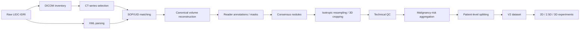

# LIDC-IDRI cleaning pipeline

The cleaning pipeline converts raw LIDC-IDRI CT studies and XML annotations
into a common, auditable nodule dataset. The purpose is to make the input
representation identical for the team's 2D, 2.5D, and 3D experiments while
keeping labels and patient assignments fixed.

The final sequence is: **Raw LIDC-IDRI → DICOM inventory → CT-series
selection → XML parsing → SOP/UID matching → canonical volume reconstruction
→ reader annotations / masks → consensus nodules → isotropic resampling → 3D
cropping → technical QC → malignancy-risk aggregation → patient-level
splitting → V2 dataset → 2D / 2.5D / 3D experiments**.

## Inputs

The raw inputs are LIDC-IDRI DICOM CT studies and XML files containing
radiologist nodule annotations. The pipeline treats these as separate sources
that must be joined through identifiers; it does not assume directory order is
clinically meaningful.

## Phase 1: indexing and validation

1. **DICOM inventory.** DICOM headers are read recursively and recorded in a
   machine-readable inventory. Pixel arrays are not needed for this stage, so
   indexing is fast and the source data remains untouched.
2. **CT-series identification.** Series are grouped by study and series UID.
   Modality, SOP class, instance count, and slice geometry are checked so
   scout, localizer, and other non-CT series are not used as volumes.
3. **XML inventory.** XML files are parsed for patient, study, series, reader,
   nodule, polygon, and referenced SOP information. CT annotation XML is
   separated from non-CT/CXR XML using the authoritative DICOM context.
4. **SOP/UID matching.** XML SOP references are matched to DICOM instances
   within the correct patient/study/series context. Unmatched references are
   reported as a warning, not silently treated as valid slices.

 Final Phase 1 counts were 1,010 patients, 244,527 readable DICOM records,
 1,318 readable XML files (1,035 CT annotation XML and 283 non-CT/CXR XML),
 1,018 CT series, 77,262 SOP references, 77,100 matches, 162 unmatched
 references, and zero failed patients. The report also records 290 excluded
 non-CT series; this is a series count, not an XML-file count.

## Phase 2: canonical volumes and reader masks

Selected CT slices are ordered by their physical position derived from
`ImageOrientationPatient` and `ImagePositionPatient`, rather than by filename.
Pixel values are converted to HU with the DICOM rescale slope and intercept.
This matters because filenames and stored pixel values are not guaranteed to
represent physical order or calibrated attenuation.

Each XML polygon is mapped to its DICOM slice and rasterized into a reader-level
mask. The phase created 1,018 CT volumes, 20,362 reader-level annotation
records, and 20,316 masks. Missing annotation series, unmatched ROI references,
out-of-bounds polygons, and processing failures are retained in statistics and
validation reports. The retained final-run statistic for unmatched ROI
references is 97; the source code names and computes this field, although the
original project no longer retains the final Phase 2 aggregate JSON.

## Phase 3: consensus, sampling, and labels

Reader annotations in the same CT series are clustered using physical centroid
distance and native-voxel bounding-box overlap. Reader-session identity is
tracked so duplicate annotations from one session do not count as independent
readers. Clusters exceeding configured reader, annotation, diameter, or
disagreement limits are flagged and excluded from the primary cohort.

The final Phase 3 run produced 7,385 consensus nodules from 990 represented
patients. Volumes were resampled to 1 mm isotropic spacing and cropped around
the consensus nodule to `(104,72,80)` in `(Z,Y,X)` order, with a configured
context margin, crop rounding, fill value, and crop-coverage check.

The final V2 builder copies these existing sample and mask arrays and derives
the V2 manifests. It does not regenerate or edit the arrays. Technical QC
removed 27 records (23 suspicious clusters and 4 incomplete crop-coverage
records), leaving 2,654 supervised rated nodules and 4,713 technically valid
unrated nodules available for the training-only SSL pool.

## Risk labels and splits

Reader malignancy scores are aggregated by median into benign (1.0–2.0),
indeterminate (2.5–3.0), and malignant (3.5–5.0). These are risk-assessment
labels, not pathology outcomes. Patient IDs are assigned once to train,
validation, or test so that nodules from one patient cannot cross a split.
The fixed counts are documented in [DATA_SPLITS.md](DATA_SPLITS.md).

The SSL CSV contains 5,133 technically valid nodules from training patients
only. SSL code must ignore their malignancy labels. Validation and test
patients must never enter SSL pretraining.

## Reproducibility

The source-only implementation is in [`data_pipeline/`](../data_pipeline/).
Its example configuration uses placeholders rather than personal machine
paths. Raw inputs and generated outputs are intentionally external to Git.
The final checks and their provenance are summarized in
[DATA_VALIDATION.md](DATA_VALIDATION.md).
