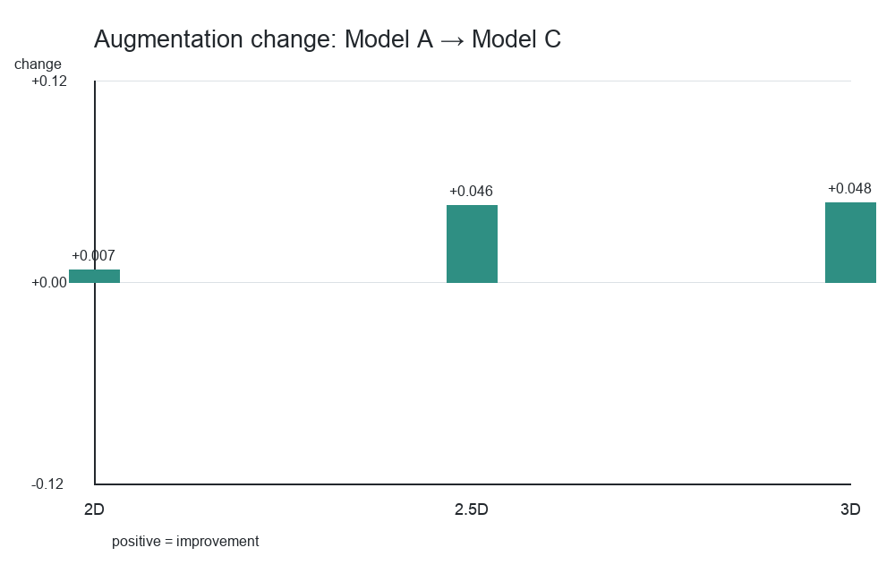
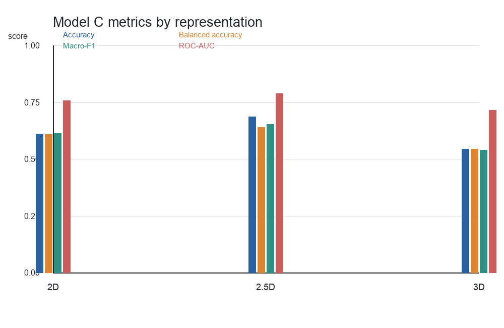
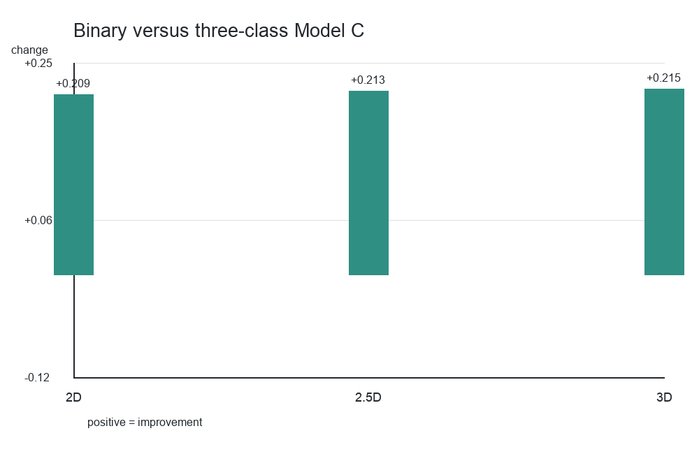
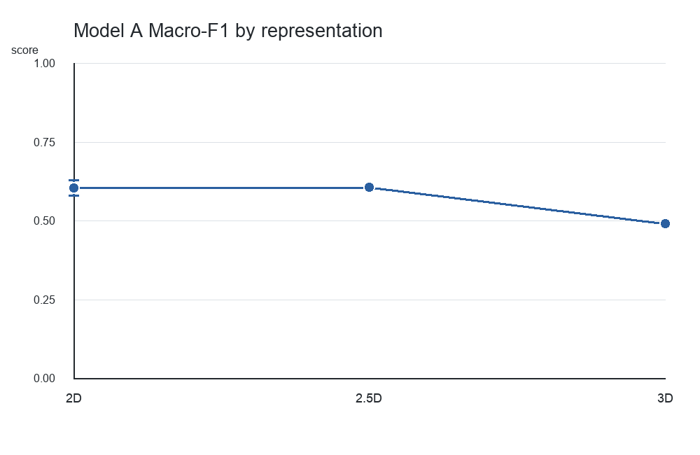
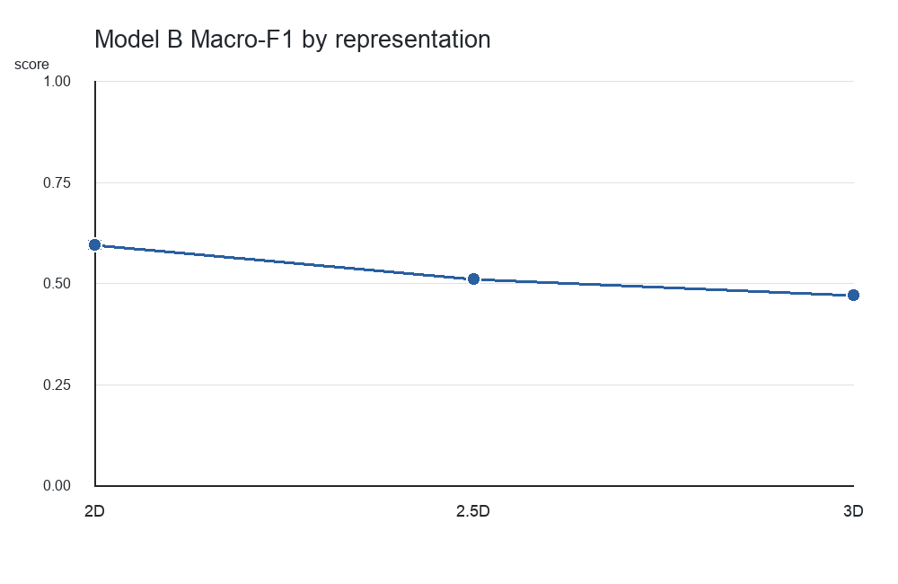
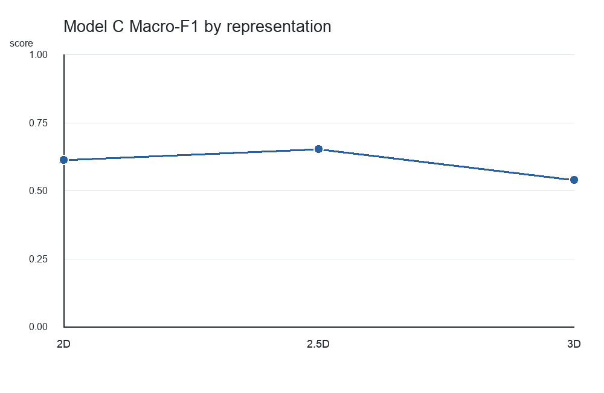
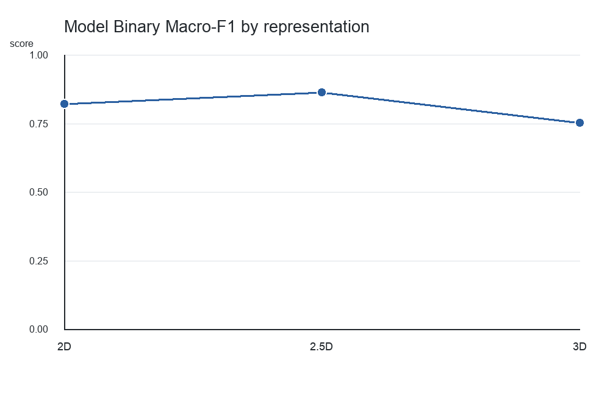
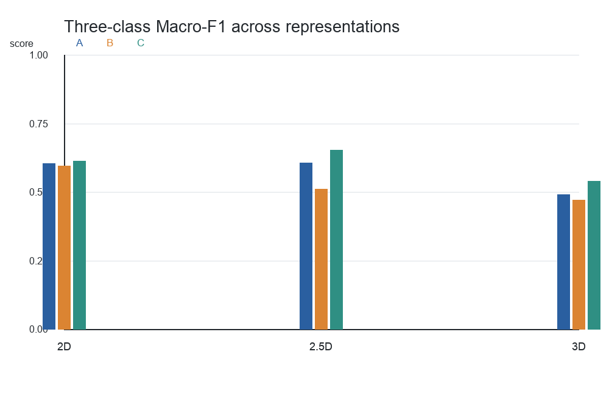
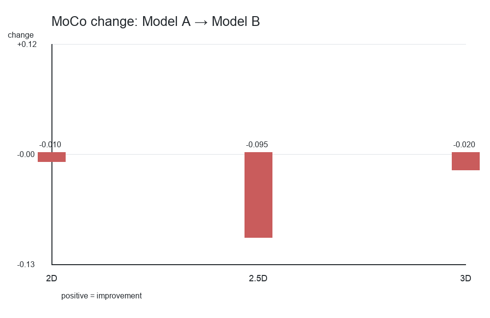

# Final 2D vs 2.5D vs 3D Comparison

## Shared experimental framework

The team comparison uses the final V2 dataset, the fixed patient-level split
policy, the same radiologist malignancy-risk label policy, and the common HU
preprocessing contract: clip to `[-1000, 400]`, then map with
`(x + 1000) / 1400` to `[0, 1]`. The primary task is benign,
indeterminate, and malignant classification. The labels are radiologist
malignancy-risk assessments, not pathology-confirmed cancer ground truth.

All tracks use the same general ResNet-18 family, but parameter counts differ
naturally between 2D, 2.5D, and 3D implementations. Model C augmentation is
representation-specific, so A-versus-C is the most direct interpretation of
its regularization effect within each representation. The 2D values are
reported as three-seed mean ± standard deviation, while 2.5D and 3D are final
selected runs without supplied multi-seed standard deviations. Small numerical
differences should therefore not be treated as statistical significance.

The complete machine-readable table is
[`results/team_comparison/final_team_metrics.csv`](../results/team_comparison/final_team_metrics.csv).

## Three-class results

### Model A: supervised baseline

| Representation | Validation Macro-F1 | Test accuracy | Test balanced accuracy | Test Macro-F1 | ROC-AUC |
|---|---:|---:|---:|---:|---:|
| 2D | 0.5982 | 0.6002 | 0.6061 | 0.6059 ± 0.024 | 0.7565 |
| 2.5D | 0.5883 | 0.6086 | 0.6060 | 0.6075 | 0.7583 |
| 3D | 0.513904 | 0.494949 | 0.479044 | 0.492761 | 0.656366 |

The 2D and 2.5D baseline results are very similar. The 3D baseline is
substantially lower and shows stronger generalization difficulty. This does
not demonstrate that dimensionality alone caused the difference: capacity,
optimization, regularization, and reporting variability also differ.

### Model B: MoCo plus supervised fine-tuning

| Representation | Validation Macro-F1 | Test accuracy | Test balanced accuracy | Test Macro-F1 | ROC-AUC |
|---|---:|---:|---:|---:|---:|
| 2D | 0.6135 | 0.5926 | 0.5908 | 0.5957 ± 0.009 | 0.7579 |
| 2.5D | 0.5516 | 0.5126 | 0.4914 | 0.5125 | 0.6922 |
| 3D | 0.512672 | 0.459596 | 0.468331 | 0.473008 | 0.669224 |

### Model C: mild training-only augmentation

| Representation | Validation Macro-F1 | Test accuracy | Test balanced accuracy | Test Macro-F1 | ROC-AUC |
|---|---:|---:|---:|---:|---:|
| 2D | 0.5962 | 0.6128 | 0.6110 | 0.6134 ± 0.007 | 0.7595 |
| 2.5D | 0.5857 | 0.6869 | 0.6413 | 0.6537 | 0.7894 |
| 3D | 0.535629 | 0.545455 | 0.546072 | 0.540307 | 0.716477 |

In this experimental setting, 2.5D Model C produced the strongest held-out
metrics among the three representation tracks. One interpretation is that
2.5D supplies useful through-plane context while remaining easier to optimize
than a full 3D network at this labelled sample size. That is a hypothesis
about this experiment, not a universal claim about 2.5D.

## MoCo analysis

The change in test Macro-F1 from Model A to Model B was:

| Representation | Model A | Model B | Delta |
|---|---:|---:|---:|
| 2D | 0.6059 | 0.5957 | -0.0102 |
| 2.5D | 0.6075 | 0.5125 | -0.0950 |
| 3D | 0.4928 | 0.4730 | -0.0198 |

Under the final protocol, MoCo did not improve downstream test Macro-F1 for
any representation. This does not demonstrate that self-supervised learning
is generally ineffective; it means that the specific MoCo configuration used
here did not produce improved downstream classification.

## Augmentation analysis

The change in test Macro-F1 from Model A to Model C was:

| Representation | Model A | Model C | Delta |
|---|---:|---:|---:|
| 2D | 0.6059 | 0.6134 | +0.0075 |
| 2.5D | 0.6075 | 0.6537 | +0.0462 |
| 3D | 0.4928 | 0.5403 | +0.0475 |

Augmentation improved held-out Macro-F1 in all three tracks. The effect was
modest in 2D and larger in 2.5D and 3D. Because the augmentation recipes are
representation-specific, these changes should primarily be interpreted as
within-representation A-versus-C comparisons.

## Best three-class results

Model C's final held-out metrics are:

| Representation | Test Macro-F1 | Accuracy | Balanced accuracy | ROC-AUC |
|---|---:|---:|---:|---:|
| 2D | 0.6134 | 0.6128 | 0.6110 | 0.7595 |
| 2.5D | 0.6537 | 0.6869 | 0.6413 | 0.7894 |
| 3D | 0.5403 | 0.5455 | 0.5461 | 0.7165 |

## Binary sensitivity analysis

The binary task excludes the indeterminate class and keeps the fixed patient
assignments. Its test Macro-F1 values are:

| Representation | Three-class Model C | Binary | Gain |
|---|---:|---:|---:|
| 2D | 0.6134 | 0.8227 | +0.2093 |
| 2.5D | 0.6537 | 0.8664 | +0.2127 |
| 3D | 0.5403 | 0.7554 | +0.2151 |

All three approaches improved substantially after the indeterminate class was
excluded. This supports the interpretation that intermediate malignancy-risk
ambiguity contributes strongly to classification difficulty, but it is not the
only possible explanation. Binary classification is inherently simpler and
uses fewer samples/classes, so binary and three-class scores are not directly
equivalent.

## Overall discussion

The 2D and 2.5D baseline results are close, whereas the 3D baseline shows more
generalization pressure. MoCo did not improve Macro-F1 in any representation,
while augmentation improved all three. The 2.5D Model C track produced the
strongest held-out three-class metrics in this study. Binary classification
substantially improved performance across all representations, showing that
more spatial context does not automatically translate to better
generalization.

One possible interpretation is that 2D is easier to optimize but lacks
through-plane context, while 2.5D provides a useful context/optimization
compromise. Full 3D provides the richest spatial representation but may need
more labelled data and stronger regularization to exploit that capacity. These
are interpretations of this experiment, not universal conclusions.

## Limitations

- Labels are radiologist-risk assessments rather than pathology confirmation.
- The labelled cohort is limited and class imbalance is present.
- The indeterminate category is ambiguous.
- The comparison uses one fixed patient-level split.
- Dimensional models have different natural capacities and parameter counts.
- Augmentation is representation-specific.
- Multi-seed reporting is unequal: three-seed summaries are available for 2D,
  but not for the 2.5D and 3D final selected runs.
- No result here should be interpreted as clinical diagnostic performance.

## Final team conclusion

Under the controlled patient-level evaluation, additional spatial context alone
did not guarantee improved malignancy-risk classification. The 2.5D
representation provided the strongest held-out performance in the final
augmented experiments, and augmentation was consistently beneficial. The
tested MoCo configuration did not improve downstream Macro-F1. The large
increase in binary performance across all representations indicates that the
middle/indeterminate risk group is an important source of difficulty. Overall,
representation dimensionality, regularization, label ambiguity, and available
sample size interact in determining generalization; no representation should
be called universally best from this study.

## Generated figures

The comparison figures are generated by
[`scripts/plot_team_comparison.py`](../scripts/plot_team_comparison.py):

